## DOCUMENTION OF PROJECT3-MERN STACK
`sudo apt update`

`sudo apt upgrade`

`curl -fsSL https://deb.nodesource.com/setup_18.x | sudo -E bash -`

`sudo apt-get install -y nodejs`
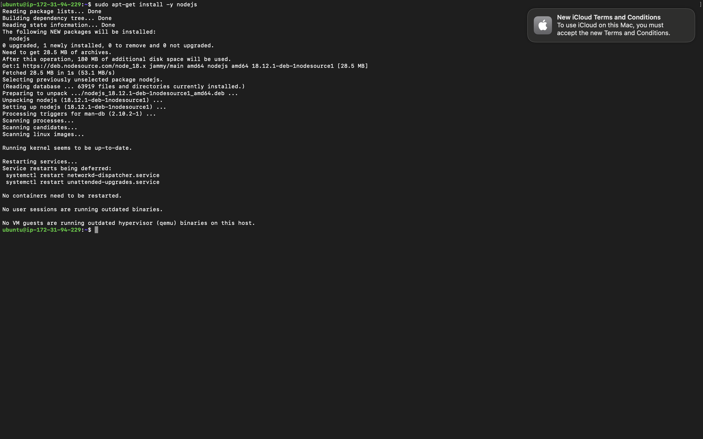

`node -v `

`npm -v `

`mkdir Todo`

`ls`

`cd Todo`

`npm init`
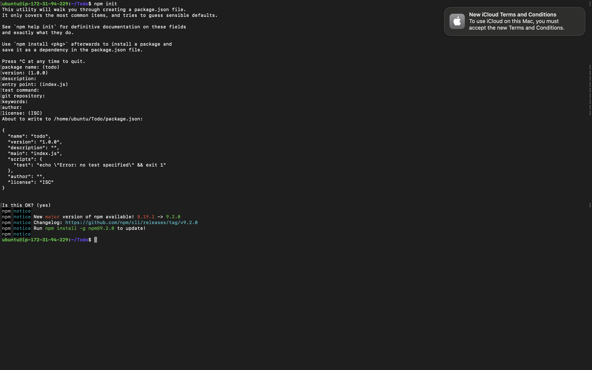

`npm install express`

`touch index.js`

`npm install dotenv`

`vim index.js`

`node index.js`
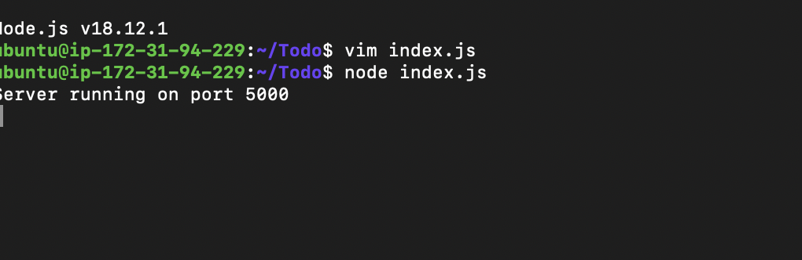
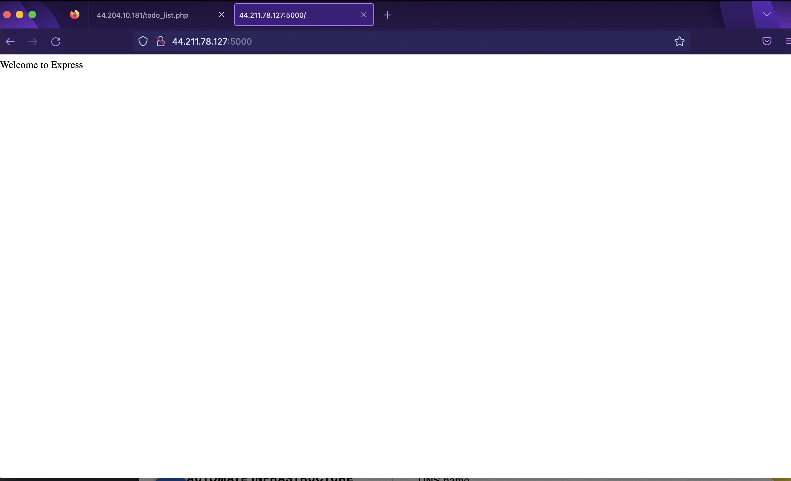

`mkdir routes`

`touch api.js`

`vim api.js`
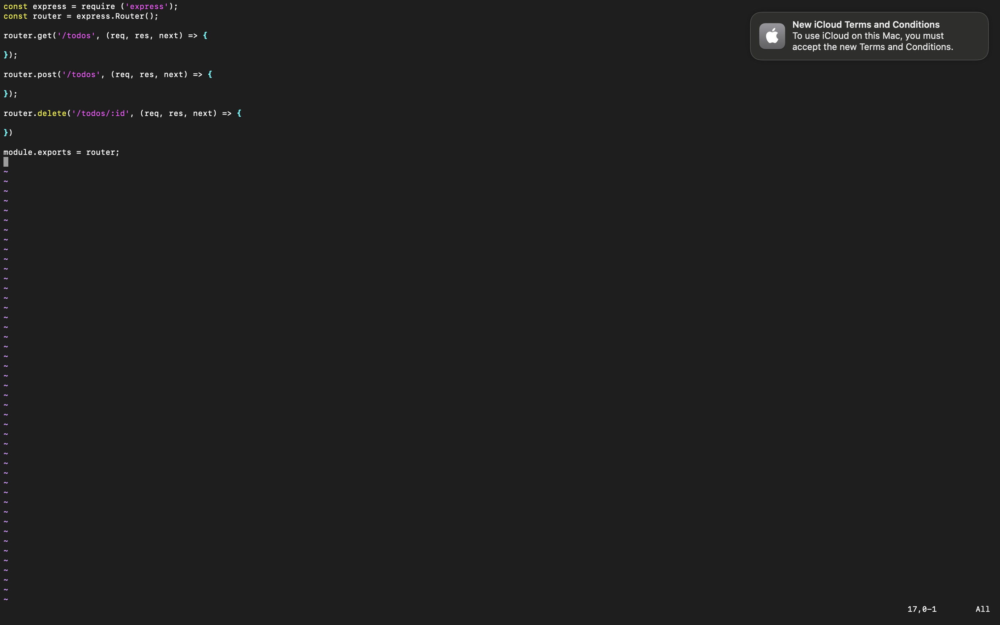

`npm install mongoose`

`mkdir models`

`touch todo.js`

`vim todo.js`
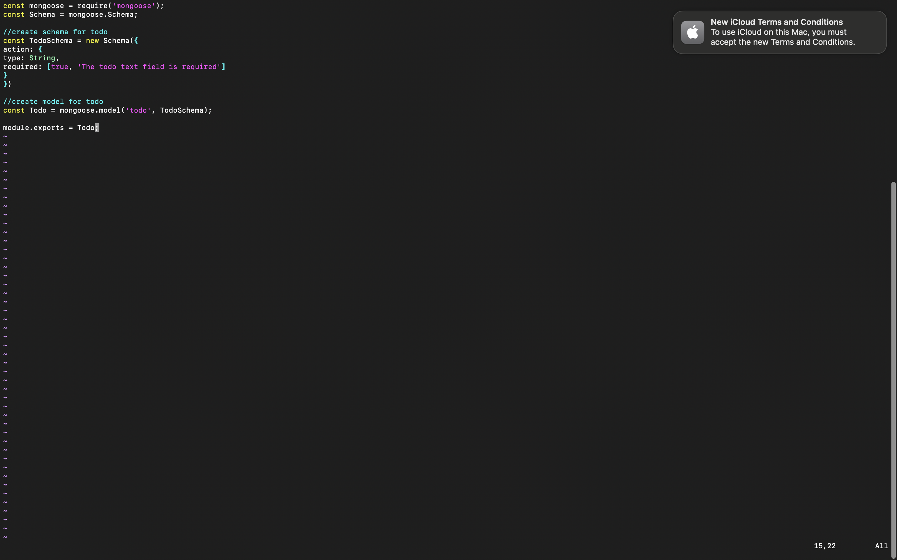

`vim api.js`
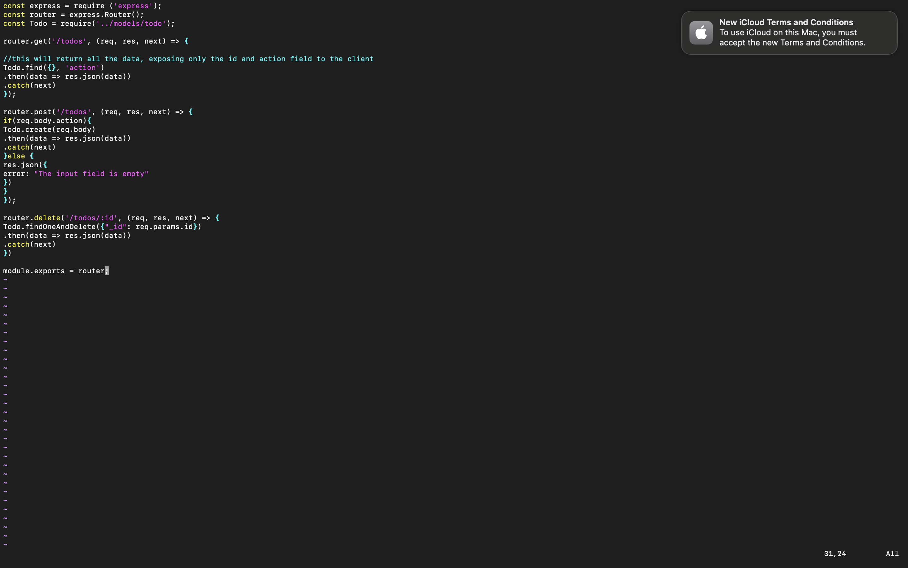

`touch .env`

`vi .env`
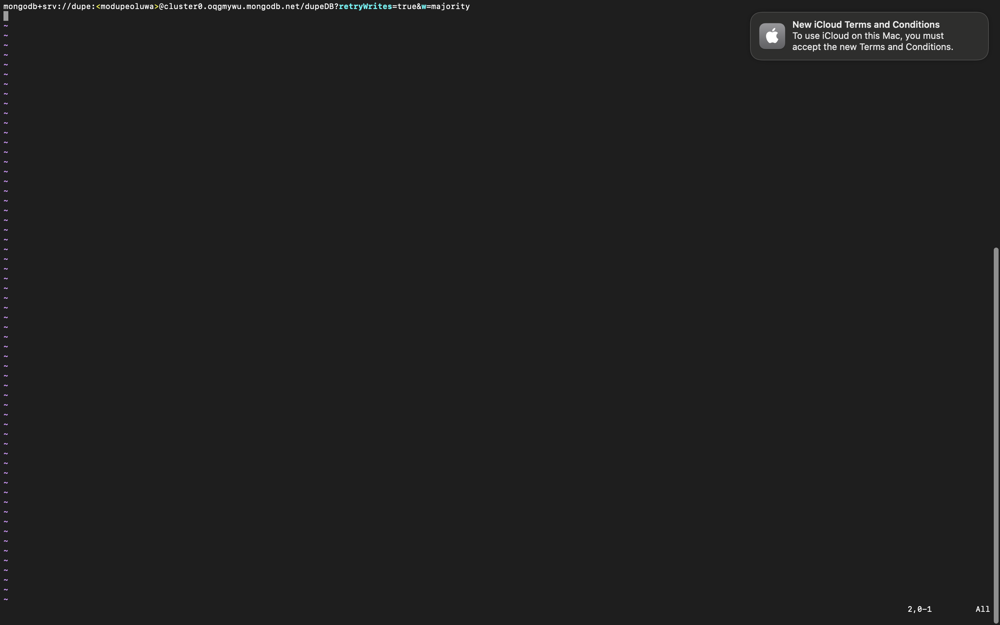

`vim index.js`
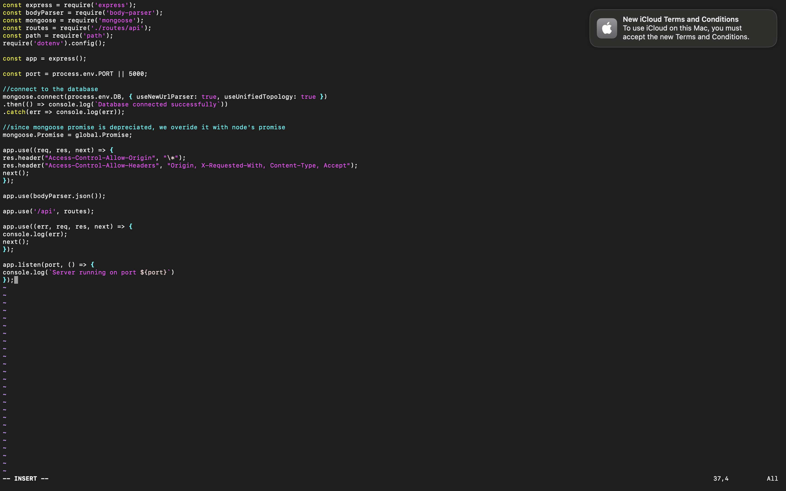

`node index.js`
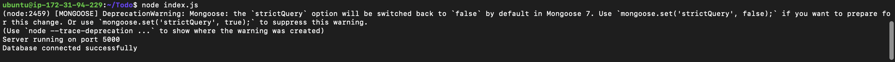

`npx create-react-app client`

`npm install concurrently --save-dev`

`npm install nodemon --save-dev`

`cd client`

`vi package.json`

`npm run dev`
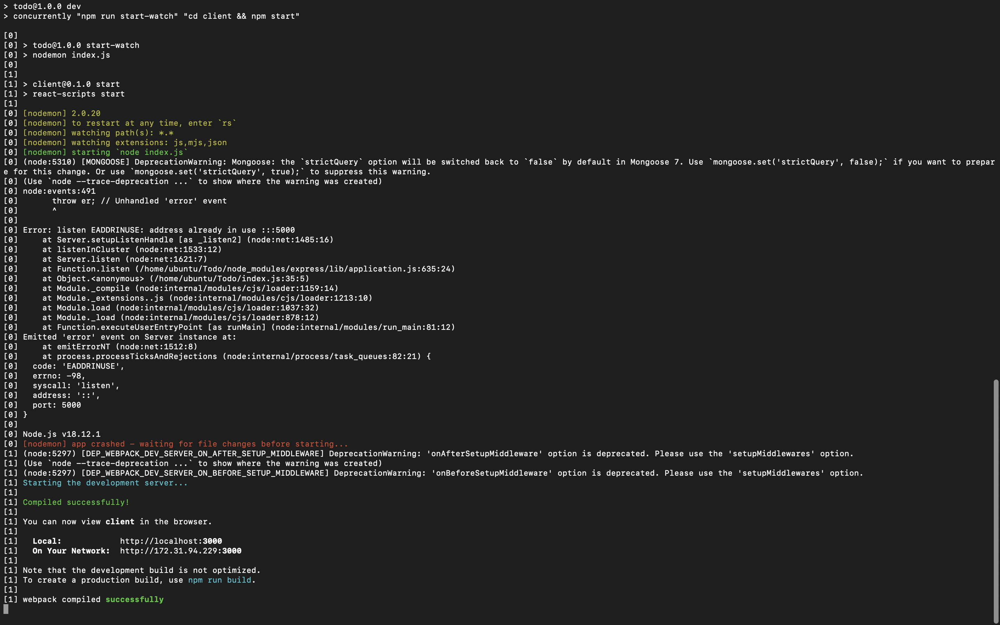
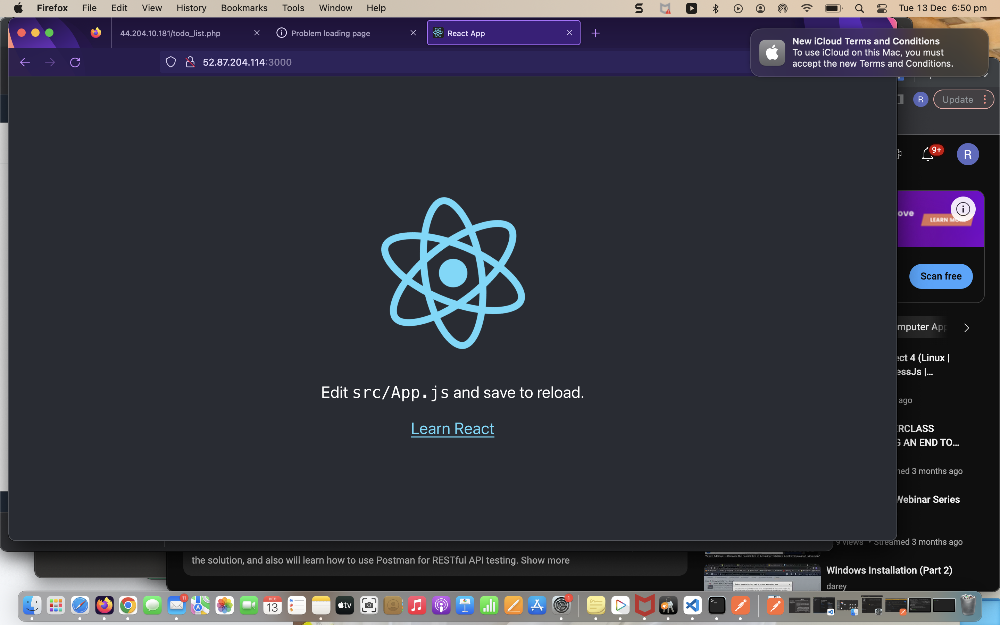

`npx create-react-app client`

`npm install concurrently --save-dev`

`npm install nodemon --save-dev`

`cd client`

`vi package.json`

`npm run dev`

`cd client && cd src `

`mkdir components && cd components`

`touch Input.js ListTodo.js Todo.js`

`vi Input.js`

`npm install axios`

`npm run dev`

